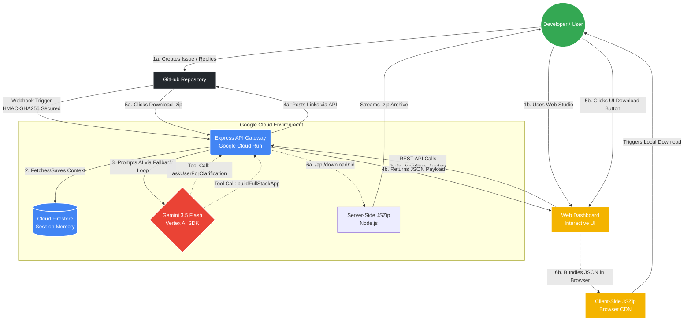

# ⚡ App-Architect-Agent
> **Autonomous Full-Stack AI Engineer & Cloud Architecture Orchestrator**

An event-driven autonomous developer agent powered by Gemini 3.5 Flash on Google Cloud Run. App-Architect-Agent operates seamlessly across two environments: listening to GitHub issues as a headless Taskmaster, and providing a real-time Interactive Web Studio. It evaluates technical requirements, resolves missing architectural pillars via batched clarifications, and scaffolds production-ready full-stack applications with instant live previews and source code downloads.

---

## 🚀 Key Features

* **Dual-Interface Orchestration:** Operates natively in two modes. It acts as a headless Taskmaster responding to GitHub webhook events, and as a Collaborative Partner accessed directly via a deployed Web Studio dashboard for interactive code generation.
* **Architectural Ambiguity Detection:** Identifies missing foundational pillars (e.g., Web3 target ecosystems or Web2 persistence models) and requests batched clarification in a single professional turn before building.
* **Stateful Multi-Turn Session Memory:** Tracks and resumes conversational sessions across stateless Cloud Run instances using Google Cloud Firestore, injecting unique `Session IDs` directly into GitHub comments and Web UI payloads.
* **Unified API Gateway:** The Google Cloud Run Express server acts as a centralized brain, routing traffic from both the Web UI and GitHub issues through the exact same Vertex AI generation loops and Firestore memory banks.
* **Enterprise Webhook Security:** Validates incoming payloads using raw-body HMAC-SHA256 signature verification (`X-Hub-Signature-256`) with strict timing-attack mitigation.
* **Multi-Region Model Failover:** Implements dynamic fallback loops across multiple Google Cloud regions to ensure high availability and prevent quota-induced interruptions.
* **LLM Edge-Case Safeguards:** Automatically intercepts and gracefully routes rogue plain-text hallucinations back into the stateful clarification loop, ensuring no webhook event or thread is ever dropped silently.
* **Dual-Environment ZIP Packaging:** Dynamically bundles directory trees into `.zip` archives using Node.js `JSZip` for webhook downloads, and CDN-based client-side `JSZip` for Web Studio downloads—eliminating disk writes and optimizing server load.
* **Isolated Live Previews:** Serves instant interactive UI previews through dedicated middleware without requiring external compiler instances.

---

## 🛠️ Architecture & Tech Stack



* **Core Runtime:** Node.js, Express, TypeScript
* **AI Model & SDK:** Gemini 3.5 Flash via `@google/genai` (Vertex AI integration)
* **Database & Persistence:** Google Cloud Firestore
* **Compute & Hosting:** Google Cloud Run (Serverless Container)
* **Packaging & Security:** JSZip, Node.js Crypto (Timing-Safe HMAC), Google Cloud Secret Manager

---

## 🚦 Local Development (CLI Mode)

You can run the agent locally with its built-in interactive multi-turn CLI:

1. **Clone the repository:**

```bash
git clone [https://github.com/Ricks0ne/App-Architect-Agent.git](https://github.com/Ricks0ne/App-Architect-Agent.git)
cd App-Architect-Agent

```

2. **Install dependencies:**

```bash
npm install

```

3. **Authenticate & Configure Environment:**
Ensure you have the Google Cloud CLI installed, authenticate your local credentials, and create a `.env` file with your project ID:

```bash
gcloud auth application-default login
echo "GOOGLE_CLOUD_PROJECT=your-project-id" > .env

```

*(Windows Users: You can manually create the `.env` file in the project root and add `GOOGLE_CLOUD_PROJECT=your-project-id` to it).*

4. **Run the CLI Engine:**

```bash
npm start

```

---

## ☁️ Deployment to Google Cloud Run

This application utilizes Google Cloud Secret Manager for enterprise-grade security, ensuring API keys are never exposed in plaintext environment variables or revision histories.

1. **Create Secrets:** In your GCP Console, navigate to Secret Manager and create two secrets named `github-token` and `github-webhook-secret` containing your actual credentials.
2. **Deploy the Container:** Run the following command to deploy the orchestrator and securely mount the secrets:

```bash
gcloud run deploy app-architect-orchestrator \
  --source . \
  --region us-central1 \
  --allow-unauthenticated \
  --max-instances=2 \
  --min-instances=0 \
  --no-cpu-throttling \
  --remove-env-vars="GITHUB_TOKEN,GITHUB_WEBHOOK_SECRET" \
  --set-secrets="GITHUB_TOKEN=github-token:latest,GITHUB_WEBHOOK_SECRET=github-webhook-secret:latest"

```

---

## 📖 Autonomous GitHub Workflow

1. **Create an Issue:** Open an issue in your repository describing your desired application (e.g., *"Build a decentralized token staking platform with a dark theme"*).
2. **Clarification Turn (If Ambiguous):** If key architectural pillars are missing, the agent intercepts the build, replies with a structured checklist, and embeds a unique `Session ID`.
3. **Resume Session:** Reply directly to the comment with your preferences. The agent parses the `Session ID`, loads the saved conversational state from Firestore, and resumes the workflow.
4. **Instant Delivery:** Upon successful scaffolding, the agent posts a final comment containing the Firestore Record ID, an interactive Live Preview URL, and a direct `.zip` download link.

---

## 🎨 Interactive Web Studio Workflow

1. **Access the Dashboard:** Navigate to the deployed Cloud Run `.run.app` URL.
2. **Initial Generation:** Enter your architectural requirements. The orchestrator will process the prompt through Vertex AI and return a live preview.
3. **Iterative Refinement:** If the architecture needs adjustments, use the update input. The agent reads the existing in-memory file tree and surgically updates the specific components without losing prior context.
4. **Live Preview & Export:** Interact directly with the rendered UI or download the `.zip` source code.